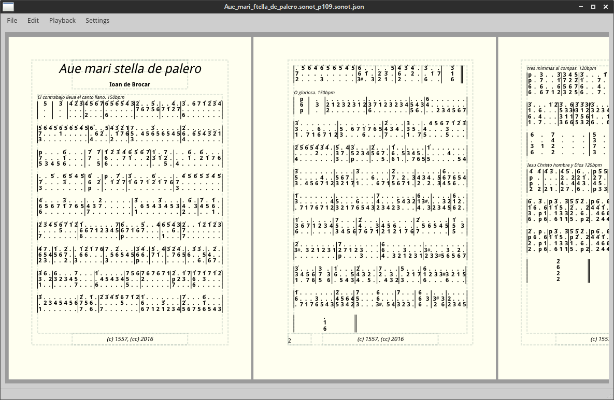

# Sonot - Spanish Organ Notation

This software is totally under development.

The main purpose is to enter 16th century spanish organ tablature and translate it into modern formats. Currently supports layouting, live editing and playback of tablature data and (halfway) export to MusicXML.

Framework: Qt5, License: GPL

Below is some brainstorming, vocabulary and class hierarchy.

## VOCABULARY

      Notes
      /  \
     /    \
    |123456|
     |
    Note

         "Bar"
         /  \     Note
        /    \    | column
        |1 2 |5 6 7 8| row \                . .| ...|
        |2   |7''    | row  > line of score  . | .. |
        |  4 |p   3  | row /                   | .  |
        \                                          /
         \--------------NoteStream----------------/

          *top annotation
    |1   |p 6 7 8|
    |  3 |    8 9|
       *bot. annotation

    page
    |------------|
    | |NN|N |  | | row/staff/voice \
    | |N |  | N| | row/staff/voice / line
    |            |
    | |N |N | N| |
    | |NN|N |N | |
    |------------|
       || || ||
        column

## GENERAL DATA

### Note
- 1,, - 7'', p, space, ..., annotation, newline, newpage, ...

### Bar
- length (number Notes)
- data[length] of Note

### NoteStream
- voices
- data[voice][rows] of Bar

### Score::Index
- stream
- bar
- row
- column

### Score::Selection
- Score::Index from, to
- create NoteStream from selection
- clipboard

### Score
- data[] of NoteStream
- Score::Index

### ScoreEditor
- undo/redo
- ScoreEditorCursor
- add/del/change
    - setScore(Score)
    - insertNote(Index, n)
    - insertBars(Index, QList<Bar> rows)
    - changeNote(Index, n)
    - changeBar(Index, b)
    - deleteNote(Index)
    - deleteBar(Index)
    - deleteStream(Index)
- Qt signals
    - scoreChanged()
    - noteValuesChanged(QList<Index>)
    - barsChanged(QList<Index>)
    - streamChanged(Index)
    - notesAboutToBeDeleted(QList<Index>)
    - notesDeleted(QList<Index>)
    - barsAboutToBeDeleted(QList<Index>)
    - barsDeleted(QList<Index>)
    - streamsAboutToBeDeleted(QList<Index>)

## GUI/DRAWING

### TextItem
- alignment
- font
- bounding-box
- margin

### ScoreItem
- Score::Index, ScoreDocument::Index
- note, line, TextItem, ...
- bounding box
- draw()

### PageAnnotation
- TextItem[] (title, header, footer, pagenum, ...)

### PageAnnotationTemplate
- PageAnnotation[] (1st, odd, even, last, ...)

### PageSize
- width/height (mm)
- preset

### PageLayout
- PageSize
- page margins[odd/even]
- portrait/landscape
- PageAnnotationTemplate

### ScoreLayout
- row spacing
- line spacing
- note spacing
- min/max Bar width

### PerPage<T>
- per-page (or finer) instance of T

### ScoreDocument
- Score
- ScoreEditor
- PageLayout (PerPage)
- ScoreLayout (PerPage)
- PageAnnotation (PerPage)
- createScoreItems(Score)
- updateScoreItems( from_editor_signals )
- ScoreItemForPagePos()
- ScoreItemForScoreIndex()

### ScoreView
- ScoreDocument + editor
- renderPage(QPainter*, pageIndex)
- editing

### todo
- doubling length of a bar (for selection)
- temperament
